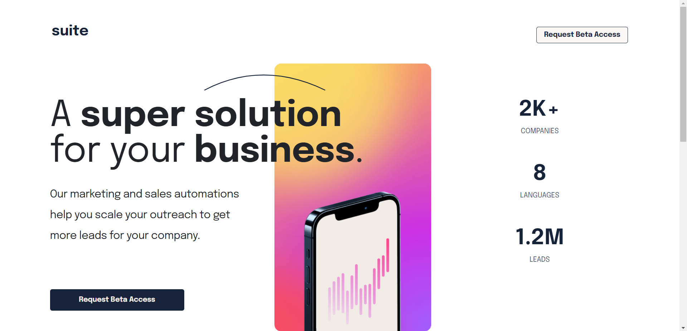

# Suite Landing Page

> This project is a landing page named "Suite", designed and built to help individuals or organisations to make informed decision to scale on leads or outreach.

## Built With 

- HTML
- CSS
- VITE

## Live Demo

[Live Demo Link](https://suitlandingpage.netlify.app/)

# Website image

## Set up(To get a local copy of this project, run following steps in your terminal)
* Clone this repo : https://github.com/nii-hub/suite.git
* Run npm install
* Run npm run dev 

## Tech ⌘⇧
- **HTML & CSS best practices:** Correct use of tags, elements, properties and syntax.
- **Gitflow:**  Correct use of Branches for deployment and features development.
- **Vite:**  Source development for production bundling.

## AUTHOR
👤 Aneal Laryea
* Github: [@nii-hub](https://github.com/nii-hub)
## 🤝 Contributing
Contributions, issues, and feature requests are welcome!

Feel free to check the [issues page](../../issues/).

## Show your support

Give a ⭐️ if you like this project!

## Acknowledgments
- Amalitech
- Front-end Mentors

## Design Template
* Designed by Amalitech

## 📝 License

This project is [MIT](./LICENSE) licensed.